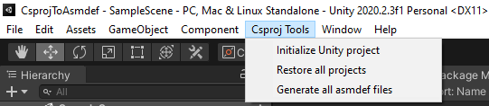

# CsprojToAsmdef

Generate [asmdef](https://docs.unity3d.com/Manual/ScriptCompilationAssemblyDefinitionFiles.html) files from csproj files inside Unity3D. Features:

- Use project references from outside of Unity
- Add NuGet packages
- Support Roslyn analyzers
- Build Unity code using the .NET CLI. Does not support creating a runnable application



## Installation

- Make sure a recent version of the .NET cli is installed, and ```dotnet``` is available from the PATH.
- Use [OpenUPM](https://openupm.com/) to install the package.

```bash
openupm add com.kuraiandras.csprojtoasmdef
```

1. In the new menu item click the button: Initialize Unity project
2. Create a class library project inside the Assets folder. Makes sure that the project is using .NET Standard 2.0 (.NET Framework 4.7 should also be supported, but it is not tested)
3. Add the created csproj to a solution. This preferably should be located above the base unity folder (or higher in hierarchy)
4. Make sure the Directory.Build.props file references the desired Unity and Language version
5. Click the generate all asmdef files button
6. Click the restore all projects button
7. Make sure the ```bin``` folder is ignored in version control - or don't
8. Make sure the ```.obj``` folder is ignored in version control
8. Make sure that .csproj files under the Assets folder are NOT ignored by version control
9. Reference NuGet packages or other .NET projects - it should be fine

The project largely relies on the [UnityAssemblies](https://github.com/DerploidEntertainment/UnityAssemblies) project. You can reference additional unity assemblies with the project properties described in that project.

You can also configure the asmdef generation via csproj properties. When the property should include multiple items each item must be separated with the ';' character. Supported properties:

| asmdef              | csproj                |
|---------------------|-----------------------|
| includePlatforms    | IncludePlatforms      |
| excludePlatforms    | ExcludePlatforms      |
| **allowUnsafeCode** | **AllowUnsafeBlocks** |
| autoReferenced      | AutoReferenced        |
| defineConstraints   | DefineConstraints     |
| versionDefines      | VersionDefines        |
| noEngineReferences  | NoEngineReferences    |

Asmdef references are handled by the following pattern:

```xml
<Reference Include="$(UnityProjectPath)\$(UnityScriptAssembliesPath)\*.dll" Private="false" />
```

Where '*' means the name of the assembly definition Unity compiles. For this to work you will need to set the ```UnityProjectPath``` property to point to the correct folder (usually a relative path upwards. Check out Sample.csproj).

## Current State

- [VSTU](https://docs.microsoft.com/en-us/visualstudio/gamedev/unity/get-started/visual-studio-tools-for-unity) is not supported
- Debugging works, if you attach the Unity debugger manually (VSTU button, attach unity debugger)
- ReSharper (and possibly Rider) works as expected
- VSCode can attach debugger, can't start editor.
- Currently the package requires Unity 2020.2 . It should work from 2019.1 and up, but will require manual installation. This might change in the future
- Multiple csproj files are supported (in separate folders), but cross referencing them is not
- Requires a Unity installation. If you want to use this in a CI/CD environment you will need to install the Unity Editor, although you do not need to run or activate it in order to work. If you have UPM references, you will need to make Unity initialize the project

Contribute if you can. VSTU support seems like a mystery.
