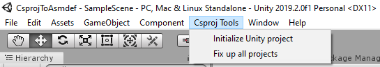

# CsprojToAsmdef [](https://github.com/KuraiAndras/CsprojToAsmdef/actions/workflows/publish.yml) [](https://www.nuget.org/packages/CsprojToAsmdef.Cli/) [](https://openupm.com/packages/com.kuraiandras.csprojtoasmdef/)

Generate [asmdef](https://docs.unity3d.com/Manual/ScriptCompilationAssemblyDefinitionFiles.html) files from csproj files inside Unity3D. Features:

- Use project references from outside or inside of your Unity project
- Add NuGet packages
- Support Roslyn analyzers
- Build Unity code using the .NET CLI. Does not support creating a runnable application



## About

The project utilizes a combination of a few hacks. You references Unity assemblies, and UPM packages using the [UnityAssemblies](https://github.com/DerploidEntertainment/UnityAssemblies) project. The common properties are by default stored in Directory.Build.props files. If you don't like this approach you can freely customize your build as long as you provide the expected project properties. The asmdef files for the Unity projects are generated using a .NET CLI tools, which is invoked when building the projects under the ```Assets``` folder.

## Installation

- Make sure a recent version of the .NET cli is installed, and ```dotnet``` is available from the PATH
- Use [OpenUPM](https://openupm.com/) to install the package
- Install the ```CsrpojToAsmdef.Cli``` tool globally

```powershell
dotnet tool install -g CsrpojToAsmdef.Cli
```

```powershell
openupm add com.kuraiandras.csprojtoasmdef
```

1. In the ```Csproj Tools``` menu click the button: ```Initialize Unity project```
2. Create a new ```Class Library project``` inside the Assets folder. Makes sure that the project is using .NET Standard 2.0 (.NET Framework 4.7 should also be supported, but it is not tested)
3. Add the created csproj to a solution. This preferably should be located above the base unity folder (or higher in hierarchy). Do not use the solution generated by Unity
4. Click the generate all asmdef files button
5. Make sure the ```.bin``` and ```.obj``` folders are ignored in version control
6. Make sure that .csproj files under the Assets folder are NOT ignored by version control
7. Reference NuGet packages or other .NET projects
8. In the ```Csproj Tools``` menu click the button: ```Fix up all projects```. Do this every time when you make changes to the project structure, add NuGet packages, add project references ***or make changes to code located outside of the assets folder***.

### Project properties and includes

The project largely relies on the [UnityAssemblies](https://github.com/DerploidEntertainment/UnityAssemblies) project. You can reference additional unity assemblies with the project properties described in that project.

You can configure the asmdef generation via csproj properties. When the property should include multiple items each item must be separated with the ';' character. Supported properties:

| asmdef              | csproj                |
| ------------------- | --------------------- |
| includePlatforms    | IncludePlatforms      |
| excludePlatforms    | ExcludePlatforms      |
| **allowUnsafeCode** | **AllowUnsafeBlocks** |
| autoReferenced      | AutoReferenced        |
| defineConstraints   | DefineConstraints     |
| noEngineReferences  | NoEngineReferences    |

### Unsupported asmdef properties

- VersionDefines

## Upgrade guide

- Upgrade the UPM package to the desired version
- Install the global tool with the same version as the package

## Current State

- [VSTU](https://docs.microsoft.com/en-us/visualstudio/gamedev/unity/get-started/visual-studio-tools-for-unity) is not supported yet
- Debugging works, if you attach the Unity debugger manually (Debug -> Attach Unity Debugger)
- ReSharper (and possibly Rider) works partially
- VSCode can attach debugger, can't start editor. Debugging editor code is not supported
- Unity 2019.2 and up is supported
- Requires a Unity installation. If you want to use this in a CI/CD environment you will need to install the Unity Editor and possibly activate it with a valid license.

Contribute if you can. Fixing the Visual Studio, Visual Studio Code and Rider integration packages seems hard.
